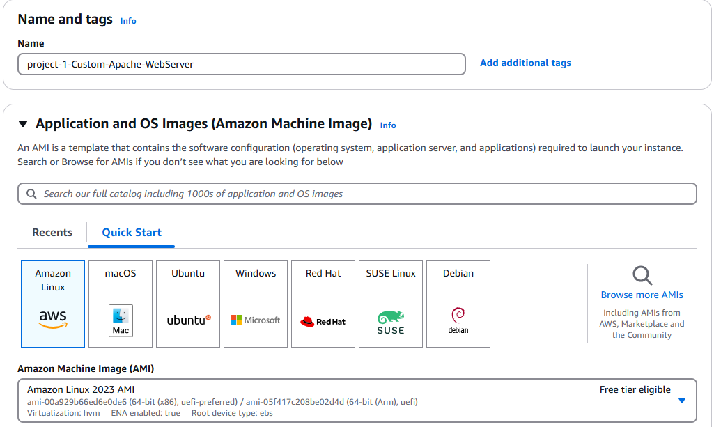
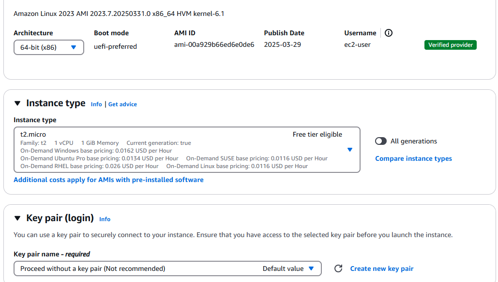
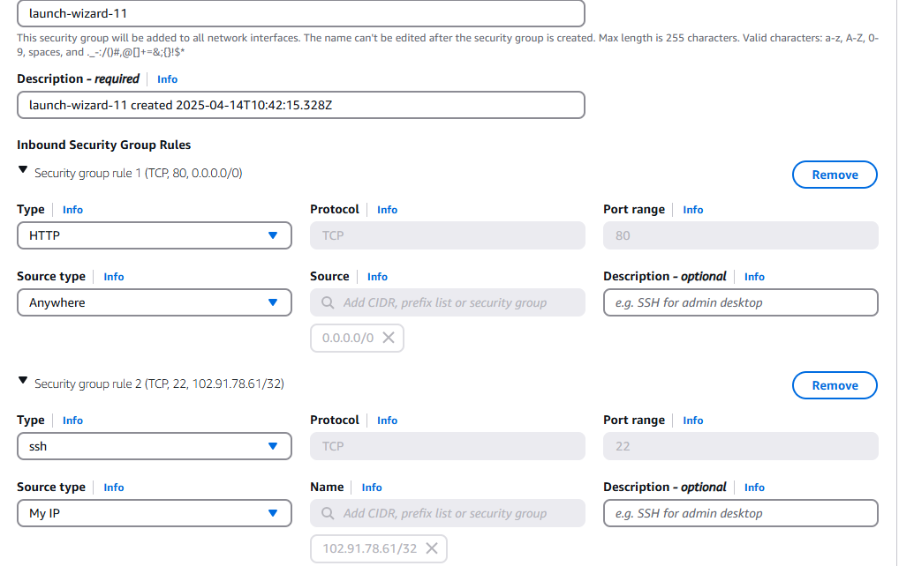
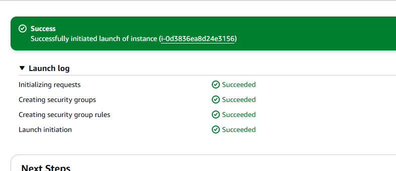

### **Project: Deploy a Custom Apache Web Server on Amazon EC2**  

#### **Description:**  
In this project, you will launch an **Amazon EC2 instance** using **Amazon Linux 2023** and configure it as a web server with **Apache (httpd)**. You will create a **customized webpage** with a visually appealing design. The setup will be automated using **User Data**, ensuring that the web server and webpage are configured automatically upon instance startup.

## **Steps to Complete the Project**  

### **Step 1: Launch an Amazon EC2 Instance**  
1. Sign in to your **AWS Management Console**.  
2. Navigate to **EC2 Dashboard**. 
3. Click on **Launch Instance**.  
4. Configure the following:  
   - **Name:** `project-1-Custom-Apache-WebServer`  
   - **AMI:** Amazon Linux 2023  
   

   - **Instance Type:** `t2.micro` (Free Tier eligible)  
   - **Key Pair:** Proceed without a key pair 
   
   - **Network Settings:**  
     - Ensure **Auto-assign Public IP** is enabled  
     - **Create a new security group** with the following rules:  
       - **Allow HTTP (80) from Anywhere (`0.0.0.0/0`, `::/0`)**  
       - **Allow SSH (22) from your IP**  
       

   - **User Data:** Copy and paste the script below (see next section).  

5. Click **Launch Instance**.  
       

### **Step 2: Configure User Data for Automatic Setup**  
To automate the installation of Apache and deploy a custom webpage, add the following script to **User Data** during EC2 instance launch:  

```bash
#!/bin/bash
# Update package list and install Apache
dnf update -y
dnf install -y httpd

# Start and enable Apache service
systemctl start httpd
systemctl enable httpd

# Set permissions for Apache root directory
chown -R ec2-user:ec2-user /var/www/html

# Create a custom index.html page
cat <<EOF > /var/www/html/index.html
<!DOCTYPE html>
<html lang="en">
<head>
    <meta charset="UTF-8">
    <meta name="viewport" content="width=device-width, initial-scale=1.0">
    <title>Welcome to My Custom Apache Server</title>
    <style>
        body {
            font-family: Arial, sans-serif;
            background-color: #f4f4f4;
            text-align: center;
            padding: 50px;
        }
        .container {
            background: white;
            padding: 20px;
            border-radius: 10px;
            box-shadow: 0px 0px 10px rgba(0, 0, 0, 0.1);
            display: inline-block;
        }
        h1 {
            color: #333;
        }
        p {
            color: #666;
        }
    </style>
</head>
<body>
    <div class="container">
        <h1>Welcome to My Custom Apache Web Server!</h1>
        <p>Hosted on an Amazon Linux 2023 EC2 Instance.</p>
        <p>This page was deployed automatically using AWS User Data.</p>
    </div>
</body>
</html>
EOF

# Restart Apache to apply changes
systemctl restart httpd
```

### **Step 3: Verify the Web Server is Running**  
1. Go to the **EC2 Dashboard** and find your instance.  
2. Copy the **Public IPv4 Address**.  
3. Open a web browser and go to `http://<your-public-ip>`.  
4. You should see your custom webpage! 🎉  
